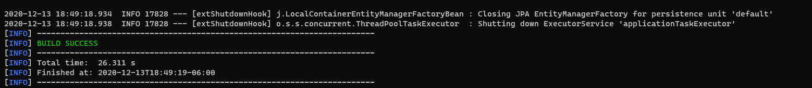
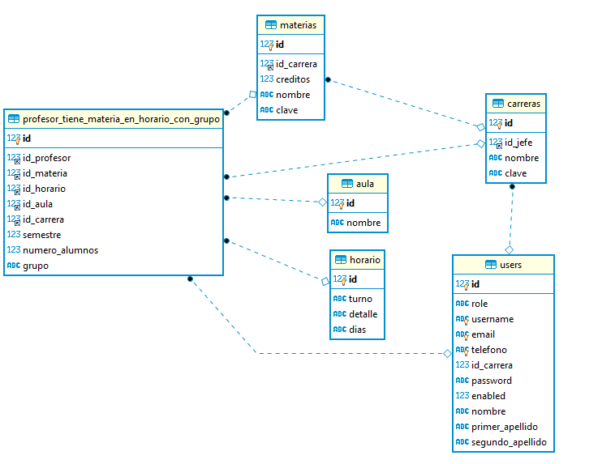

# WebApp con Java utilizando el patrón de diseño MVC

### Resumen
Aplicación Java Web usando MVC.
Para la persistencia se utilizó  el framework [Hibernate](https://hibernate.org/orm/).
Como herramienta de compilación se utiliza [Maven](https://maven.apache.org/).

### Descripción
La aplicación puede hacer las siguientes acciones:
Crear, editar y borrar una carrera.
Crear, editar y borrar una materia. 
Cargar un archivo separado por comas(csv) con las materias x carrera.
Un listado de la Sabana de materias que se ofrecen, por carrera. --
Reporte de materias x profesor. (Los profesores pueden dar clases en diferentes carreras)
Verificar que un profesor no se le empalme un horario.
Perfil del usuario (Nombre, correo, teléfono, departamento,
El sistema debe de contar con roles para acceso a la información, dependiendo del tipo de usuario:
          Rol de administrador: Crear carreras, asignar jefes y profesores por carrera.
          Rol de Jefe de Carrera: Listar, añadir, cargar, borrar y editar Materias; ver la sabana y reportes de 
                                                  materias por maestro, de la carrera a su cargo.
                                                  Si el jefe maneja 2 carreras, debe de poder escoger con que carrera trabajar.
          Rol de profesor: Ver SU reporte de materias.


### Correr la aplicación.

Para correr la aplicación necesitará tener cubiertos los siguientes puntos:

1. Tener maven 3.2 o superior instalado.
2. Tener un servidor de MySQL, al que se tenga acceso para crear la base de datos correspondiente (Es necesario que ejecute el script llamado database.sql en su servidor).
3. Una vez cuente con su servidor MySQL debe ajustar el archivo application.properties con los datos de conexión que correspondan a su servidor.

4. Tambien puede correr la aplicación con docker compose.

Una vez tenga los anteriores puntos cubiertos proceda con los siguientes pasos.

#### Ejecutar la aplicación con maven.
```
./mvnw spring-boot:run
```

#### Ejecutar la aplicación con docker compose.
1. Muévase a la carpeta Docker
2. Ejecute el siguiente comando

```
docker-compose up -d
```

Deberá eventualmente tener un resultado similar al siguiente en la terminal.


A partir de aquí se puede ingresar a la url que se indica en la consola.


### Base de datos normalizada.



### Puntos que se podrían mejorara de la aplicación.
1. Mejorar el aspecto de la interfaz de usuario.
2. Mejorar la manera en la que se construye la imagen de docker.
